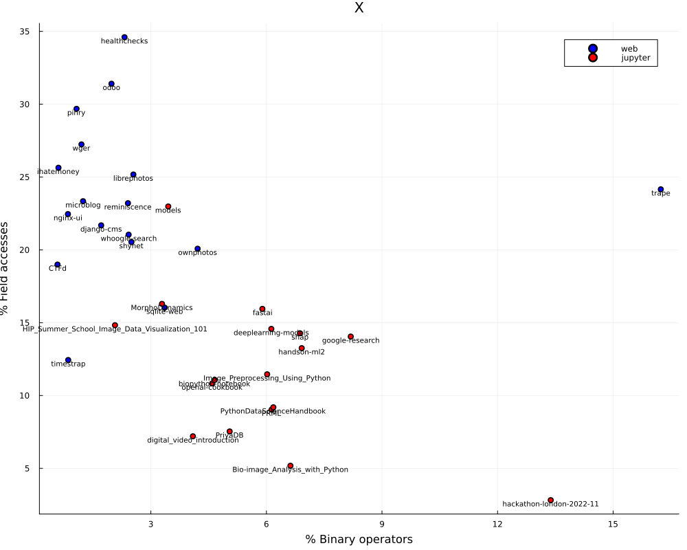
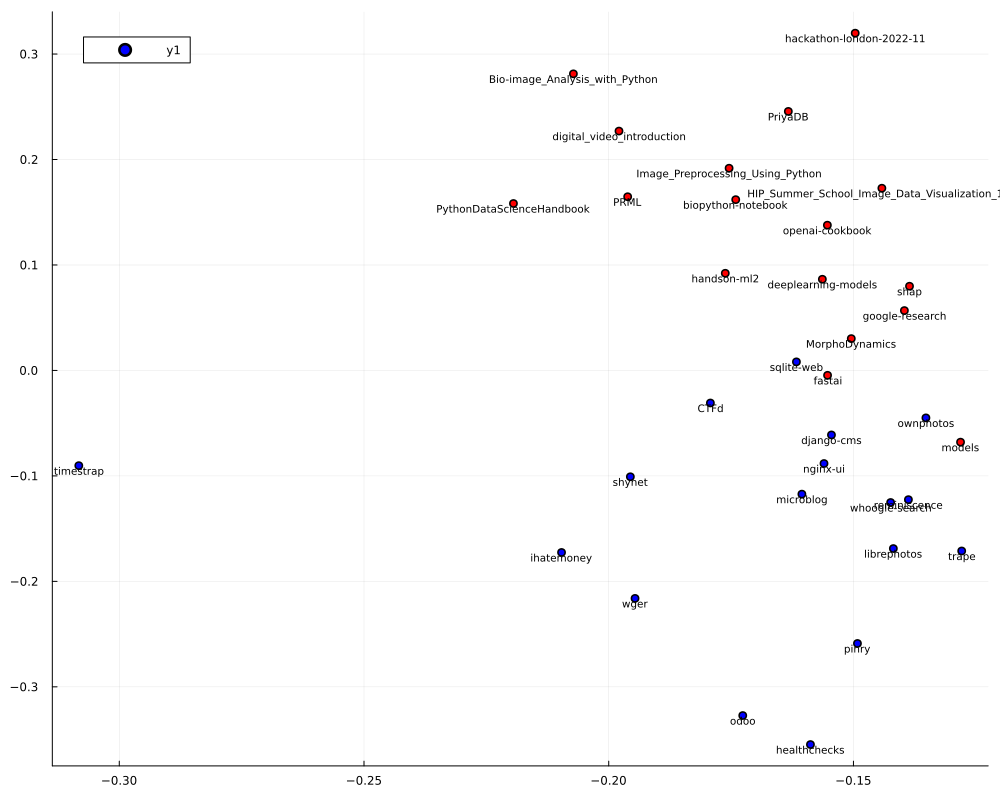

# Quantitative coding style analysis

This project analyzes syntax trees from Tree-sitter parser to count the number of certain patterns in given files. It can be used to compare coding styles across projects.

For example, comparing the number of binary expressions and attribute (field) access expressions, there seems to be a clear difference between "data science Python" and "web Python".
The following chart compares a number of ~random github projects found in the [explore section](https://github.com/explore)

Similarly, performing PCA on 18 different metrics naturally splits the projects between what could be classified as web and data science.

The software for analysis is described in more details in the [tree-sitter-analyzer](./tree-sitter-analyzer/) folder.

## Jupyter Python vs "normal" Python

By comparing metrics from parsed Jupyter notebook and Python code we can gain some interesting results.
Comparing web applications with Jupyter notebooks results in many significant differences, but even comparing the code in notebooks with other code data science related code shows many differences.
Data mostly comes from the same repositories, comparing `.py` files with `.ipynb` files (see [the entire list](./tree-sitter-analyzer/found-repos.json)).
Often the Python files contain a model implementation, while the notebooks are only using it, so the differences are probably coming from this distinction.

The used metrics are (all are normalized to `filesize`, unless explicitly noted)
* `filesize` - number of expressions and statements in the file
* `expressions / statements` - number of expressions per statement
* `binary_operators` - number of binary operator expression, for example `a+b`, `a or b`, `a < b`, ...
* `chained_calls` - chained method invocation, for example `a().b().c()` counts as 2, since two methods are invoked on another method call
* `class_defs` - number of class definitions
* `conditions` - number of conditional statements and expressions, for example `if`, `match` statements and the `X if C else Y` expression
* `decorators` - number of [decorators](https://peps.python.org/pep-0318/), for example `@lru_cache() ...`
* `field_accesses` - field read expressions, for example `a.b`
* `field_assignments` - field write statements
* `function_defs` - number of function definitions, nested functions count, but lambda functions don't count
* `identifier_len_avg` - average length of an identifier, for example `test = test4` averages at 4.5 (not divided by filesize)
* `function_len_avg` - average length of a function, measured in number of expressions it contains
* `indexing` - number of subscript expressions - array or dict indexing (both write and read), for example `a[1] = b["x"]` counts as 2
* `invocations` - number of function calls
* `lambda_functions` - number of lambda functions
* `literals` - number of non-trivial literal numbers and strings (empty string, 0 and 1 don't count)
* `loops` - number of loops, including list comprehensions 
* `nested_functions` - number of functions defined in another function (normalized to number of function definitions)
* `slicing` - number of index range expressions, for example `a[1:4] = 10`, or `a[1:, 4:5]` which would count as 2
* `try_catches` - number of try-catch statements
* `variable_assignments` - number of variable assignments, both `a = 1` and `a := 1` count

Simplest way to analyze the differences would be to compare the mean values and perform logistic regression on the collected data.

Note that the dataset contains approximately 10k files, but only from a handful of repositories.
This means the data is not representative of the entire Python ecosystem and it inflates the p-values, I'd be careful interpreting them.
It allows us to compare the various metrics, but not necessarily estimate the probability of type 1 error.
Significant variables are highlighted.

| Metric                         | Mean Script  |  Mean Notebook  | Coef.        | Std. Error | `Pr(>︱z︱)` | Lower 95%   |   Upper 95%  |  Z     |
| ------------------------------ | ------------ | --------------- | ------------ | ----------- | -------- | ------------ | ------------ | ------ |
| **filesize**                   | 319.43       |  474.69         |   0.00115334 |  7.60433e-5 |   <1e-51 |   0.00100429 |   0.00130238 |  15.17 |
|   expressions                  |   2.80       |    2.66         |  -0.0356255  |  0.0353654  |   0.3138 |  -0.104941   |   0.0336895  |  -1.01 |
|   binary_operators             |   0.04       |    0.05         |   3.64275    |  0.903893   |   <1e-04 |   1.87115    |   5.41435    |   4.03 |
|   chained_calls                |   0.0079     |    0.0106       |   9.65613    |  2.84907    |   0.0007 |   4.07206    |  15.2402     |   3.39 |
|   class_defs                   |   0.0067     |    0.0017       | -28.4881     | 11.079      |   0.0101 | -50.2025     |  -6.77364    |  -2.57 |
| **conditions**                 |   0.03       |    0.01         | -20.799      |  3.23907    |   <1e-09 | -27.1475     | -14.4506     |  -6.42 |
|   decorators                   |   0.0053     |    0.00084      | -40.1106     | 11.4779     |   0.0005 | -62.6068     | -17.6143     |  -3.49 |
|   field_accesses               |   0.16       |    0.09         |  -0.329696   |  0.742077   |   0.6568 |  -1.78414    |   1.12475    |  -0.44 |
| **field_assignments**          |   0.018      |    0.008        |  10.973      |  2.00696    |   <1e-07 |   7.03941    |  14.9066     |   5.47 |
| **function_defs**              |   0.033      |    0.014        | -37.9536     |  3.19586    |   <1e-31 | -44.2173     | -31.6898     | -11.88 |
| **function_size_avg**          |  31.30       |   13.98         |  -0.0488137  |  0.00301891 |   <1e-58 |  -0.0547307  |  -0.0428968  | -16.17 |
| **identifier_len_avg**         |   8.24       |    6.64         |  -0.409005   |  0.0312479  |   <1e-38 |  -0.47025    |  -0.347761   | -13.09 |
|   indexing                     |   0.04       |    0.05         |   4.37744    |  1.06372    |   <1e-04 |   2.29258    |   6.4623     |   4.12 |
| **invocations**                |   0.22       |    0.27         |   6.94191    |  0.544066   |   <1e-36 |   5.87556    |   8.00826    |  12.76 |
|   lambda_functions             |   0.0017     |    0.0012       |  -8.27764    |  8.03311    |   0.3028 | -24.0223     |   7.46697    |  -1.03 |
|   literals                     |   0.28       |    0.26         |  -0.64063    |  0.230956   |   0.0055 |  -1.0933     |  -0.187964   |  -2.77 |
|   loops                        |   0.012      |    0.015        |  10.2928     |  2.8882     |   0.0004 |   4.63207    |  15.9536     |   3.56 |
|   nested_functions             |   0.07       |    0.02         |  -1.76228    |  0.49418    |   0.0004 |  -2.73086    |  -0.793708   |  -3.57 |
|   slicing                      |   0.0082     |    0.0145       |  -0.828764   |  1.94291    |   0.6697 |  -4.6368     |   2.97927    |  -0.43 |
|   try_catches                  |   0.00044    |    0.00048      |   7.5404     | 11.6946     |   0.5191 | -15.3805     |  30.4614     |   0.64 |
| **variable_assignments**       |   0.11       |    0.12         |   8.01635    |  0.922104   |   <1e-17 |   6.20906    |   9.82364    |   8.69 |

We can large differences in unsurprising variables, such as `class_defs` and `decorators`.
However, the linear regressions seems to think that other variables explain the differences better.

Unsurprisingly, notebooks also contain much less function definitions, since code can easily be written outside of functions.
Somewhat more surprisingly, the function they do contain are much shorter.

<!--

                                                    filesize 319.43064 474.69062
                        expressions_total / statements_total  2.80264  2.65766
                           binary_operators_total / filesize  0.03684  0.04857
                              chained_calls_total / filesize  0.00789  0.01062
                                 class_defs_total / filesize  0.00665  0.00170
                                 conditions_total / filesize  0.02574  0.01022
                                 decorators_total / filesize  0.00533  0.00084
                             field_accesses_total / filesize  0.16144  0.09472
                          field_assignments_total / filesize  0.01823  0.00802
                              function_defs_total / filesize  0.03315  0.01355
                                           function_size_avg 31.29684 13.98251
                                          identifier_len_avg  8.23747  6.63907
                                   indexing_total / filesize  0.04267  0.05300
                                invocations_total / filesize  0.22217  0.26876
                           lambda_functions_total / filesize  0.00165  0.00122
                                   literals_total / filesize  0.27739  0.26108
                                      loops_total / filesize  0.01188  0.01502
        nested_functions_total / max(1, function_defs_total)  0.06666  0.02291
                                    slicing_total / filesize  0.00821  0.01447
                                try_catches_total / filesize  0.00044  0.00048
                       variable_assignments_total / filesize  0.10657  0.12381

|                                                             |  Mean Script  |  Mean Notebook  |
|-------------------------------------------------------------|---------------|-----------------|
|                                                    filesize |  319.43       |  474.69         |
|                        expressions_total / statements_total |    2.80       |    2.66         |
|                           binary_operators_total / filesize |    0.04       |    0.05         |
|                              chained_calls_total / filesize |    0.01       |    0.01         |
|                                 class_defs_total / filesize |    0.01       |    0.00         |
|                                 conditions_total / filesize |    0.03       |    0.01         |
|                                 decorators_total / filesize |    0.01       |    0.00         |
|                             field_accesses_total / filesize |    0.16       |    0.09         |
|                          field_assignments_total / filesize |    0.02       |    0.01         |
|                              function_defs_total / filesize |    0.03       |    0.01         |
|                                           function_size_avg |   31.30       |   13.98         |
|                                          identifier_len_avg |    8.24       |    6.64         |
|                                   indexing_total / filesize |    0.04       |    0.05         |
|                                invocations_total / filesize |    0.22       |    0.27         |
|                           lambda_functions_total / filesize |    0.00       |    0.00         |
|                                   literals_total / filesize |    0.28       |    0.26         |
|                                      loops_total / filesize |    0.01       |    0.02         |
|        nested_functions_total / max(1, function_defs_total) |    0.07       |    0.02         |
|                                    slicing_total / filesize |    0.01       |    0.01         |
|                                try_catches_total / filesize |    0.00       |    0.00         |
|                       variable_assignments_total / filesize |    0.11       |    0.12         |
-->
